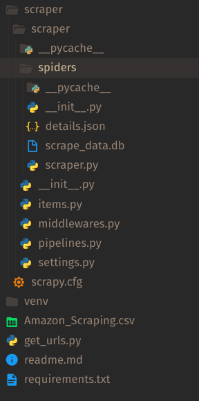

### Installation
- created a virtual environment inside the task folder
- intialized the project using "scrapy" `pip install Scrapy`
  `scrapy start scraper`
- in order to run the scraper
    * install scrapy using `pip install Scrapy`
    * install the requirements.txt using `pip install -r requirements.txt`
    * also install `pip install scrapy-user-agents`
- I created a file get_urls.py and using the provided csv file i accumulated all the 1000 urls.

### File Structure

### Files
- #### scraper.py
    this file contains the main code for scraping the data from the provided
    1000 urls.
    it scrapes data:
    * Product Title
    * Product Image URL
    * Product Price
    * Product Details

- #### pipelines.py
    this file is needed for the fullfillment of bonus task 2,
    I have used the sqlite3 for the dumping of scraped data in the database. Database is named "scrape_data.db" and scrape_data.db has table scrape_tb.
    All this is defined in the pipelines.py

- #### settings.py
    after running the scraper I had got scraped data into a json file but got some errors(particularly solve captcha one's), on again scraping the data again for storing into an database, to resolve these errors i bumped into a technique called `User Agent Rotation`, this bypassed the captcha thing.
    Since there's a library that contains about 2200 random user agents, which can be installed as
    `pip install scrapy-user-agents`
, also scrapy `settings.py` would need some modifications as below:
    > DOWNLOADER_MIDDLEWARES = {
    'scrapy.downloadermiddlewares.useragent.UserAgentMiddleware': None,
    'scrapy_user_agents.middlewares.RandomUserAgentMiddleware': 400,
    }

- #### Time Taken

Following were the observations for time taken to scrape every 100 urls:

     0-100, duration -> 0:00:05.444729 secs
     100-200, duration -> 0:00:01.844651 secs
     200-300, duration -> 0:00:01.706558 secs
     300-400, duration -> 0:00:01.887783 secs
     400-500, duration -> 0:00:01.775081 secs
     500-600, duration -> 0:00:01.816537 secs
     600-700, duration -> 0:00:01.803937 secs
     700-800, duration -> 0:00:01.706529 secs
     800-900, duration -> 0:00:01.682743 secs
     900-1000, duration -> 0:00:01.952949 secs

    
        
            
